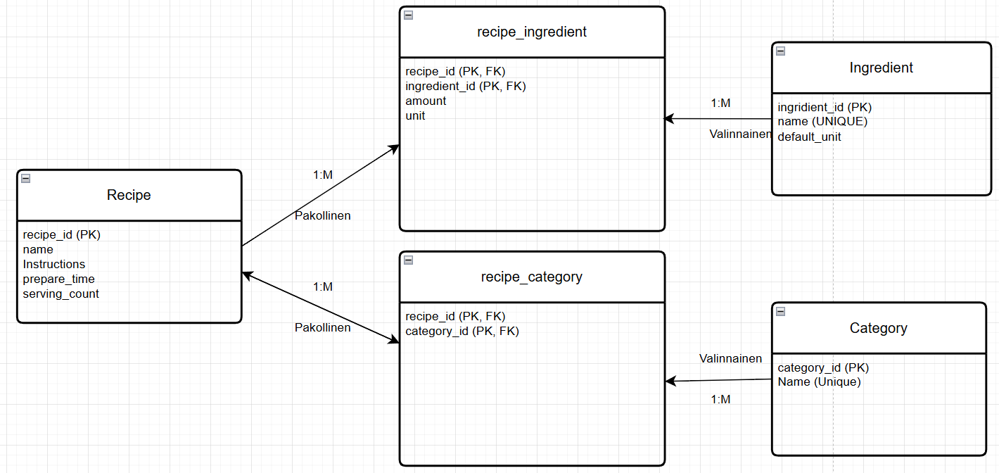
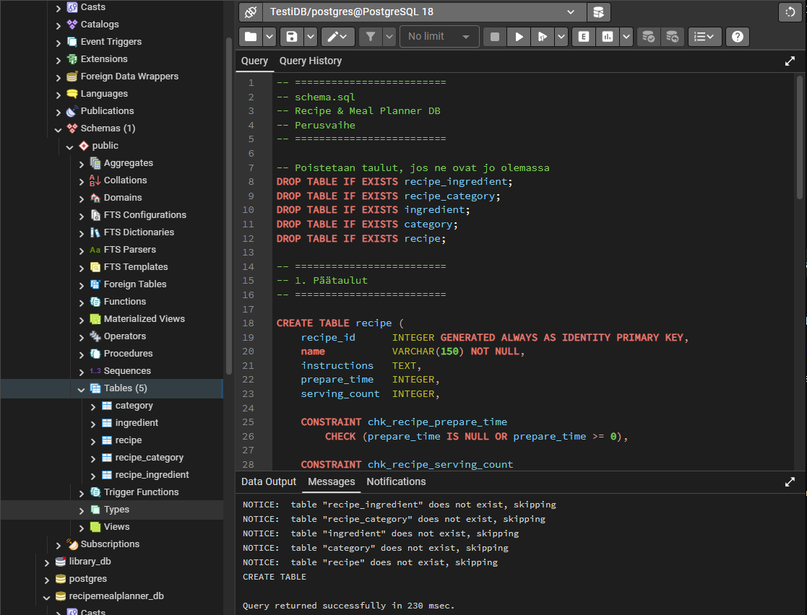
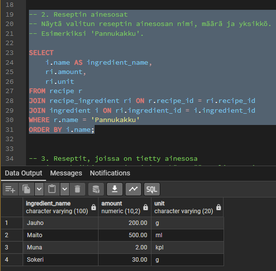
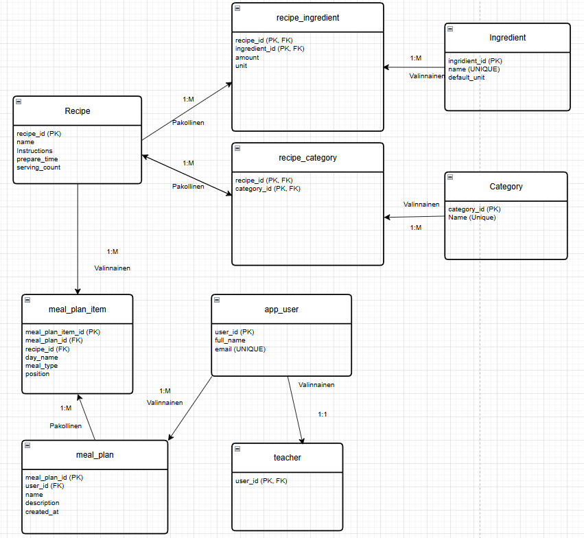
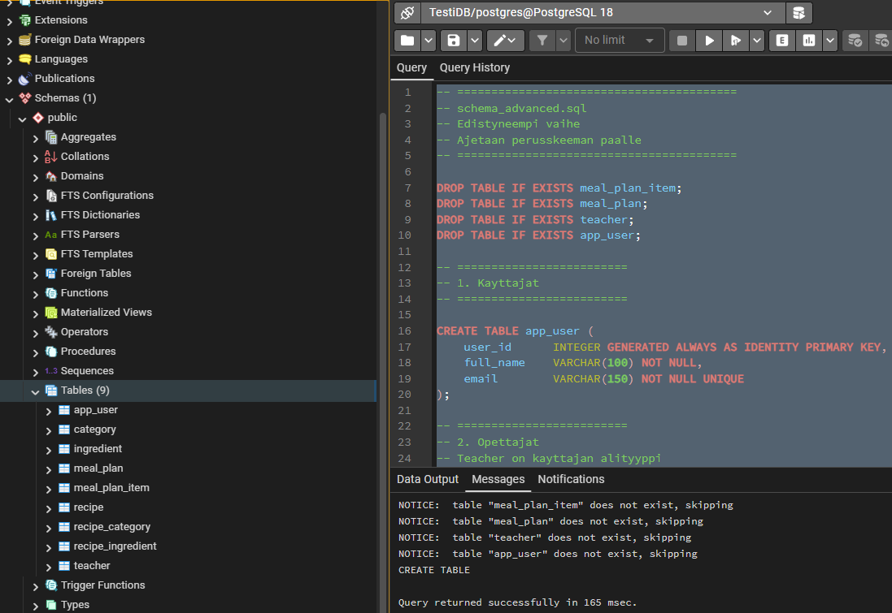
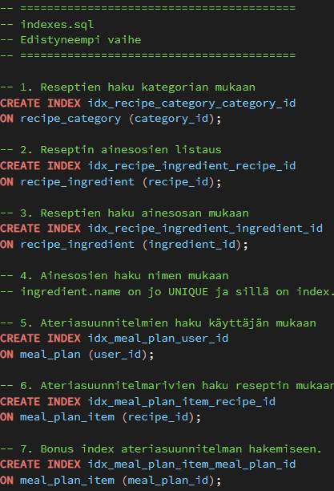
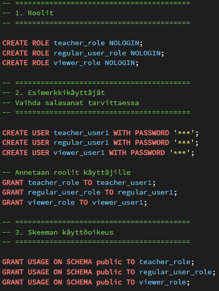
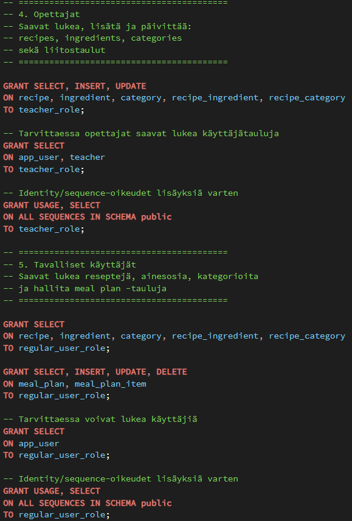
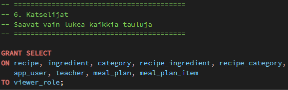
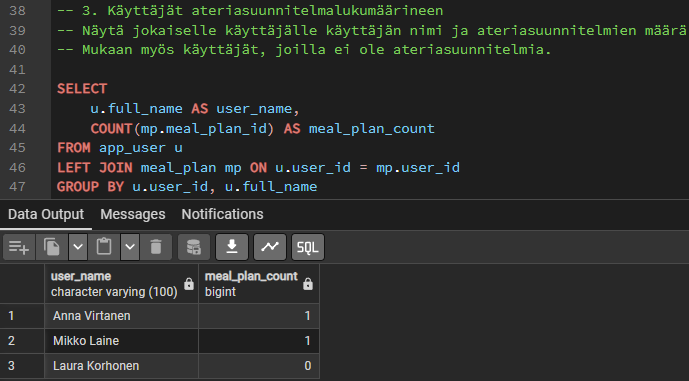

# Resepti- ja ateriasuunnittelutietokanta -projektin raportti

GitHub: https://github.com/xamk-mire-classroom/tietokannat-26-harjoitukset-Jampe4.git

## 1. Johdanto

Tässä projektissa tein PostgreSQL-tietokannan reseptien ja ateriasuunnitelmien hallintaan. Tavoitteena oli suunnitella tietokanta itse alusta asti niin, että se täyttää tehtävän vaatimukset ja toimii oikein.

Suoritin tässä työssä perusvaiheen ja edistyneemmän vaiheen. ORM-vaihetta en tehnyt. Toteutin työn pgAdminilla ja käytin PostgreSQL:ää.

Projektissa piti tehdä joitain omia suunnitteluratkaisuja. Esimerkiksi käyttäjien oikeuksia ei ollut helppo rajata niin, että tavallinen käyttäjä voisi muokata vain omaa dataansa pelkillä perusrooleilla. En myöskään pystynyt toteuttamaan täysin tietokantatasolla sääntöä, jonka mukaan resepti ei saisi jäädä ilman kategoriaa.

## 2. Perusvaihe

### 2.1 ER-kaavio ja suunnittelupäätökset

Perusvaiheessa tein ER-kaavion, jossa oli viisi päätaulua: `recipe`, `category`, `ingredient`, `recipe_category` ja `recipe_ingredient`.

Suurin suunnittelupäätös oli se, että tein reseptin ja kategorian väliin oman liitostaulun `recipe_category`, koska yksi resepti voi kuulua useaan kategoriaan ja yksi kategoria voi sisältää monta reseptiä. Sama ajatus oli reseptin ja ainesosan välillä. Niiden väliin tuli `recipe_ingredient`, koska yksi resepti käyttää monta ainesosaa ja sama ainesosa voi olla monessa reseptissä.

`recipe_ingredient`-taulu oli erityisen tärkeä tehdä omaksi taulukseen, koska siinä piti tallentaa myös lisätietoa, eli määrä ja yksikkö. Sitä ei olisi voinut mallintaa järkevästi pelkällä suoralla yhteydellä.

Merkitsin suhteisiin myös pakollisuuden ja valinnaisuuden. Ajatuksena oli, että reseptillä pitää olla vähintään yksi kategoria ja vähintään yksi ainesosa. Sen sijaan ainesosa tai kategoria voi olla olemassa ilman, että sitä on käytetty missään reseptissä.

Mietin myös yksinkertaisempaa mallia, jossa esimerkiksi kategoria olisi ollut suoraan reseptitaulussa, mutta se ei olisi toiminut hyvin, koska resepti voi kuulua useaan kategoriaan. Siksi liitostaulurakenne oli tässä parempi ratkaisu.

*Kuva 1. Perusvaiheen ER-kaavio.*

### 2.2 Skeeman toteutus

Perusskeema tehtiin `CREATE TABLE` -lauseilla. Käytin pääavaimissa identiteettisarakkeita, koska ne tekevät riveistä yksilöllisiä ja niihin on helppo viitata muista tauluista.

Tietotyypeissä käytin esimerkiksi `VARCHAR`-tyyppiä nimille, `TEXT`-tyyppiä ohjeille, `INTEGER`-tyyppiä valmistusajalle ja annosmäärälle sekä `NUMERIC`-tyyppiä määrälle, jotta myös desimaalit ovat mahdollisia.

Lisäsin skeemaan muutamia rajoitteita, jotta data pysyy järkevänä. Kategorian ja ainesosan nimille laitoin `UNIQUE`-rajoitteen, jotta samoja nimiä ei voi tulla kahdesti. Valmistusajalle laitoin tarkistuksen, ettei se voi olla negatiivinen, ja annosmäärälle tarkistuksen, että sen pitää olla vähintään yksi, jos se annetaan. Ainesosan määrälle laitoin myös tarkistuksen, että sen pitää olla positiivinen.

Viiteavaimissa käytin sekä `CASCADE`- että `RESTRICT`-toimintoja. Reseptin poistamisessa käytin `ON DELETE CASCADE`, jotta myös sen liitokset poistuvat automaattisesti. Ainesosan poistamisessa käytin `ON DELETE RESTRICT`, koska ainesosaa ei kuulu voida poistaa, jos sitä käytetään reseptissä.

Kategorioiden kohdalla tehtävänannossa oli vaatimus, että resepti ei saisi jäädä ilman kategoriaa. Tätä en toteuttanut täysin tietokantatasolla, koska se olisi vaatinut triggereiden käyttöä.

*Kuva 2. Perusskeeman suoritus pgAdminissa onnistuneesti.*

### 2.3 Esimerkkidata ja kyselyt

Lisäsin tietokantaan esimerkkidataa niin, että tehtävän minimivaatimukset täyttyivät. Tietokantaan tuli useita reseptejä, kategorioita ja ainesosia sekä riittävästi rivejä liitostauluihin.

Yritin tehdä datasta mahdollisimman järkevää. Mukana oli esimerkiksi reseptejä, joilla on useampi kategoria, jotta monesta moneen -suhde näkyy oikeasti käytännössä. Lisäsin myös ainesosia niin, että jokaisella reseptillä on useampi ainesosa. Lisäsin myös käyttämättömän ainesosan suoraan `seed.sql`-tiedostoon, jotta käyttämättömiä ainesosia hakeva kysely palauttaa oikean tuloksen.

Perusvaiheen kyselyissä käytin `JOIN`-, `LEFT JOIN`-, `GROUP BY`- ja aggregaattifunktioita. Näillä sain haettua esimerkiksi kaikki reseptit kategorioineen, valitun reseptin ainesosat, reseptit jotka käyttävät tiettyä ainesosaa ja kategorioiden keskimääräiset valmistusajat.

Vaikeimmalta tuntui kysely, jossa piti näyttää kategorioiden keskimääräinen valmistusaika. Siinä piti miettiä myös sellaisia tilanteita, joissa kategorialla ei ole reseptejä tai valmistusaikoja. Ratkaisin tämän `LEFT JOIN` -rakenteella, jolloin kaikki kategoriat tulivat mukaan, vaikka niillä ei olisikaan reseptejä.

*Kuva 3. Esimerkki perusvaiheen kyselyn tuloksesta.*

## 3. Edistyneempi vaihe

### 3.1 Laajennettu suunnittelu ja ER-kaavio

Edistyneemmässä vaiheessa lisäsin tietokantaan käyttäjät, opettajat ja ateriasuunnitelmat. Uudet taulut olivat `app_user`, `teacher`, `meal_plan` ja `meal_plan_item`.

Käyttäjät mallinsin niin, että kaikki käyttäjät ovat `app_user`-taulussa ja opettajat erotetaan omassa `teacher`-taulussa. Tällä tavalla jokainen opettaja on myös käyttäjä, mutta kaikki käyttäjät eivät ole opettajia. Tämä tuntui selkeältä tavalta erottaa opettajat tavallisista käyttäjistä.

Ateriasuunnitelmat tein kahdella taululla. `meal_plan` kuvaa itse suunnitelmaa ja `meal_plan_item` kuvaa suunnitelman yksittäisiä rivejä. Riveille tallennetaan resepti sekä lisätietoa, kuten päivä, ateriatyyppi ja järjestysnumero. Tämä oli mielestäni parempi kuin yrittää tallentaa kaikki yhteen tauluun, koska yhdellä ateriasuunnitelmalla voi olla monta reseptiä eri kohdissa.

Suhteet menivät niin, että yhdellä käyttäjällä voi olla useita ateriasuunnitelmia, yhdellä ateriasuunnitelmalla voi olla useita rivejä ja yksi resepti voi esiintyä useissa ateriasuunnitelman riveissä. Kaaviossa reseptin puoli merkittiin valinnaiseksi suhteessa `meal_plan_item`-tauluun, koska resepti voi olla olemassa ilman että sitä on vielä lisätty mihinkään suunnitelmaan.

*Kuva 4. Edistyneemmän vaiheen ER-kaavio.*

### 3.2 Skeeman laajennukset, indeksit ja roolit

Edistyneemmän vaiheen skeema tehtiin lisäämällä uusia tauluja perusskeeman päälle. Tässä ratkaisussa ei tarvinnut muuttaa vanhoja tauluja, vaan kaikki uusi toiminnallisuus saatiin lisättyä uusilla tauluilla ja viiteavaimilla.

Viite-eheydessä valitsin sen, että jos käyttäjä poistetaan, myös hänen ateriasuunnitelmansa poistuvat. Samoin jos ateriasuunnitelma poistetaan, sen rivit poistuvat mukana. Reseptin poistaminen taas estetään, jos sitä käytetään ateriasuunnitelmassa.

Indeksejä lisäsin niihin sarakkeisiin, joilla hakuja tehdään usein. Näitä olivat esimerkiksi kategorian mukaan haku, reseptin ainesosien listaus, ainesosan mukaan tehtävä haku, käyttäjän ateriasuunnitelmien haku ja ateriasuunnitelmarivien haku reseptin perusteella. Ainesosan nimen hakuun ei tarvinnut tehdä erillistä indeksiä, koska `UNIQUE`-rajoite luo siihen jo automaattisesti indeksin.

Roolit tein erilliseen roles.sql-tiedostoon. Ajatuksena oli, että opettajilla on laajemmat oikeudet kuin tavallisilla käyttäjillä. Opettajat voivat lukea, lisätä ja päivittää reseptejä, ainesosia, kategorioita ja liitostauluja. Tavalliset käyttäjät voivat lukea reseptejä ja hallita ateriasuunnitelmia. Katselijoille annettiin vain lukuoikeus. Testasin myös `roles.sql`-skriptin ajamalla sen osana koko työnkulkua, ja se suorittui ilman virheitä. Näin myös roolimäärittelyt ja käyttöoikeudet saatiin testattua käytännössä.

Tavallisten käyttäjien oikeuksien rajaaminen vain omaan dataan ei ollut helppo toteuttaa pelkillä perusrooleilla ja `GRANT`-lauseilla. Tähän olisi tarvittu esimerkiksi Row Level Securityä tai sovelluslogiikkaa.

*Kuva 5. Edistyneemmän vaiheen skeeman suoritus pgAdminissa.*

*Kuva 6. Projektiin lisätyt indeksit.*

*Kuva 7. Projektin roolit.*

*Kuva 8. Opettajien ja tavallisten käyttäjien käyttöoikeudet.*

*Kuva 9. Katselijoiden käyttöoikeudet.*

### 3.3 Edistyneemmät kyselyt

Edistyneemmän vaiheen kyselyissä haettiin esimerkiksi kaikki ateriasuunnitelmat omistajineen, yhden ateriasuunnitelman reseptit ja kategoriat sekä käyttäjät ateriasuunnitelmien lukumäärineen.

Näissä kyselyissä piti yhdistää useampia tauluja samaan kyselyyn. Esimerkiksi ateriasuunnitelman reseptejä näyttävässä kyselyssä yhdistettiin `meal_plan`, `meal_plan_item`, `recipe`, `recipe_category` ja `category`. Näin saatiin näkyviin sekä resepti että sen kategoriat samassa tuloksessa.

Käyttäjien ateriasuunnitelmien lukumäärää hakevassa kyselyssä käytin `LEFT JOIN` -rakennetta, jotta myös käyttäjät, joilla ei ole yhtään ateriasuunnitelmaa, tulivat mukaan tulokseen.

*Kuva 10. Esimerkki edistyneemmän vaiheen kyselyn tuloksesta.*

## 4. Yhteenveto ja reflektio

Tässä projektissa toteutin relaatiotietokannan resepteille, ainesosille, kategorioille, käyttäjille ja ateriasuunnitelmille. Mielestäni lopputulos täyttää hyvin tehtävän tärkeimmät vaatimukset, koska rakenne on looginen, suhteet on mallinnettu erillisillä liitostauluilla ja tietokannassa on mukana myös keskeisiä rajoitteita ja viiteavaimia.

Projektin aikana opin paremmin, miten monesta moneen -suhteet mallinnetaan, miten liitostauluja käytetään, miten viiteavaimet vaikuttavat poistamiseen ja miten `SQL`-kyselyissä yhdistetään useita tauluja toisiinsa. Opin myös paremmin sen, että kaikkia liiketoimintasääntöjä ei ole aina helppo toteuttaa pelkillä perusrajoitteilla.

Jos jatkaisin projektia vielä pidemmälle, toteuttaisin tarkemman ratkaisun käyttäjien oikeuksille ja lisäisin myös tavan estää reseptin jääminen ilman kategoriaa täysin tietokantatasolla. `ORM`-vaihe olisi myös luonteva seuraava jatko tälle projektille.

Lopuksi testasin koko työnkulun ajamalla kaikki SQL-skriptit järjestyksessä alusta loppuun. Näin varmistin, että skeema, esimerkkidata, kyselyt, edistyneempi vaihe, indeksit ja roolit toimivat yhdessä ilman virheitä.

Kokonaisuutena projekti oli hyödyllinen, koska siinä joutui oikeasti miettimään sekä tietokannan rakennetta että käytännön `SQL`-toteutusta.